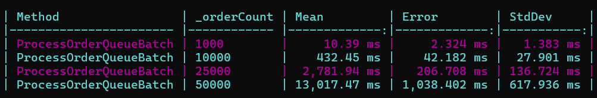
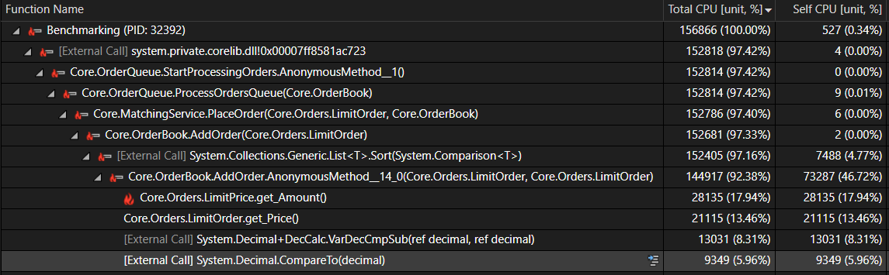
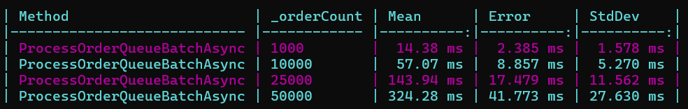
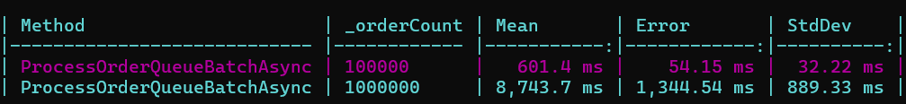

# Optimizing Order Book Performance
This project started with a simple unoptimized price priority order book, focussed solely on functionality. In this next stage the aim is to measure and improve performance where the key metric is latency. This is often a critical non-functional requirement for an order book and matching engine system.

### Baseline Benchmarking and Profiling
Results from the benchmarking and profiling:

*Figure 1: BencmarkDotNet results for unoptimized order book.*

*Figure 2: CPU usage profiling for 25000 Orders.*

**Unoptimized Order Book: [Link](Solution/Core/OrderBook.cs)**

*Key Points*
1. As _orderCount increases there is a disproportionate increase in execution time.
2. The processing time for 50,000 orders (13 seconds) is far from acceptable for low-latency systems.
3. The problem area is the sorting that occurs every time we add an order to the order book. Over 90% of CPU time is spent on adding the order to the order book. 

### Optimized Code Benchmarks
Moving to an OrderBook implementation using a binary search tree with queues at each price level greatly improves performance and moves the order processing into low latency territory. This is done because the BST can maintain sorted order with O(log n) time complexity compared to sorting a list which depending on the algorithm would likely be O(n log n). Also we are maintaing order over a smaller amount of data as only prices are stored as node keys in the BST which reduces the write pressure.

**Optimized Order Book: [Link](Solution/Core/OrderBookBST.cs)**

Results from the benchmarking:

*Figure 3: BencmarkDotNet results for optimized order book.*